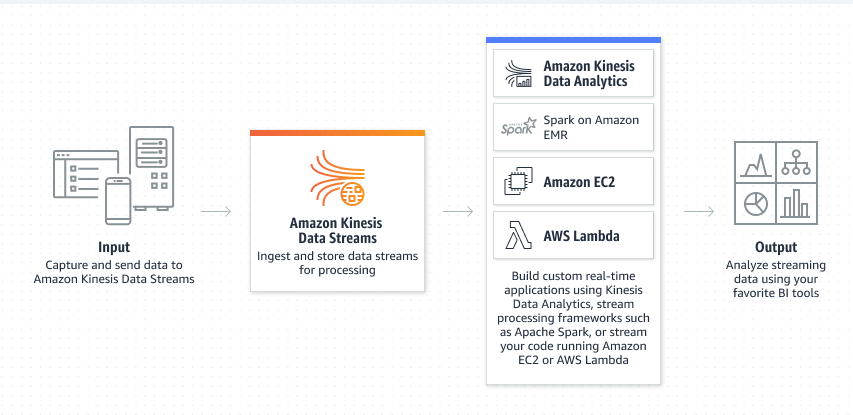

# Sumário

- [Conceitos](#conceitos)
    - [O que é Cloud Computing?](#o-que-é-cloud-computing)
    - [Vantagens da Cloud Computing](#vantagens-da-cloud-computing)
    - [Tipos de Cloud](#tipos-de-cloud)
    - [Planos de suporte da AWS](#planos-de-suporte-da-aws)
- [O IAM (Identity and Access Management)](#o-iam-identity-and-access-management)
    - [O que é o IAM?](#o-que-é-o-iam)
    - [IAM Identity Center](#iam-identity-center)
    - [AWS Organizations](#aws-organizations)
    - [Política de senhas](#política-de-senhas)
    - [CloudShell e CLI](#cloudshell-e-cli)
    - [Credential Report e Access Advisor](#credential-report-e-access-advisor)
    - [Resumo - IAM](#resumo---iam-identity-and-access-management)
    - [Resumo - Organizaçõs](#resumo---organizações)
- [A estrutura da AWS](#a-estrutura-da-aws)
    - [Infraestrutura global da AWS](#infraestrutura-global-da-aws)
    - [AWS Share Responsability Model](#aws-share-responsibility-model)
- [Elastic Compute Cloud (EC2)](#elastic-compute-cloud-ec2)
    - [Sobre EC2](#sobre-ec2)
    - [Tipos de EC2](#tipos-de-ec2)
    - [Modelos de aquisição](#modelos-de-aquisição)
    - [Resumo - EC2](#resumo---ec2)
    - [Resumo - Tipos de EC2](#resumo---tipos-de-ec2)
    - [Resumo - Security Groups](#resumo---security-groups)
- [Elastic Block Store (EBS)](#elastic-block-store-ebs)
    - [Sobre EBS](#sobre-ebs)
    - [Valores e tipos de EBS](#valores-e-tipos-de-ebs)
    - [Snapshot de um volume EBS](#snapshot-de-um-volume-ebs)
    - [Amazon Machine Image (AMI)](#amazon-machine-image-ami)
    - [Elastic File System (EFS)](#elastic-file-system-efs)
    - [Amazon FSx](#amazon-fsx)
    - [Resumo - Elastic Block Store (EBS)](#resumo---elastic-block-store-ebs)
- [Escalabilidade na EC2](#escalabilidade-na-ec2)
    - [Sobre o Auto Scaling](#sobre-o-auto-scaling)
    - [Sobre o Elastic Load Balance (ELB)](#sobre-o-elastic-load-balance-elb)
    - [Resumo em imagem de como funciona a escalabilidade na EC2](#resumo-em-imagem-de-como-funciona-a-escalabilidade-na-ec2)
- [Armazenamento S3 (Simple Storage Service)](#armazenamento-s3-simple-storage-service)
    - [Sobre o S3](#sobre-o-s3)
    - [Classes do S3](#classes-do-s3)
    - [AWS Athena](#aws-athena)
    - [AWS Snow Family](#aws-snow-family)
- [Banco de dados](#banco-de-dados)
    - [Amazon Relational Database Service (RDS)](#amazon-relational-database-service-rds)
    - [Elasticache](#elasticache)
    - [Amazon Neptune](#amazon-neptune)
    - [Amazon Glue](#amazon-glue)
- [Rede](#rede)
    - [Sobre o VPC (Virtual Private Cloud)](#sobre-o-vpc-virtual-private-cloud)
    - [Sobre o NACL (Network Access Control List)](#sobre-o-nacl-network-access-control-list)
    - [VPC Peering](#vpc-peering)
    - [VPC Endpoints](#vpc-endpoints)
    - [AWS Private Link](#aws-private-link)
    - [AWS Direct Connect](#aws-direct-connect)
    - [AWS Transit Gateway](#aws-transit-gateway)
- [Route 53 - DNS da AWS](#route-53---dns-da-aws)
    - [Políticas Route 53](#políticas-route-53)
- [Containers](#containers)
    - [O que é Docker?](#o-que-é-docker)
    - [Amazon Elastic Container Registry (Amazon ECR)](#amazon-elastic-container-registry-amazon-ecr)
    - [Amazon Elastic Container Service (Amazon ECS)](#amazon-elastic-container-service-amazon-ecs)
    - [Amazon Elastic Kubernetes Service (Amazon EKS)](#amazon-elastic-kubernetes-service-amazon-eks)
- [Integrações Cloud](#integrações-cloud)
    - [AWS Kinesis](#aws-kinesis)
    - [AWS SNS (Simple Notification Service)](#aws-sns-simple-notification-service)
    - [AWS SQS (Simple Queue Service)](#aws-sqs-simple-queue-service)
    - [AWS SES (Simple Email Service)](#aws-ses-simple-email-service)
- [Computação e Serverless](#computação-e-serverless)
    - [AWS Batch](#aws-batch)
    - [AWS LightSail](#aws-lightsail)
    - [AWS Lambda](#aws-lambda)
    - [AWS Fargate](#aws-fargate)
- [Billing e support](#billing-e-support)
    - [AWS Control Tower](#aws-control-tower)
    - [AWS RAM (Resource Access Manager)](#aws-ram-resource-access-manager)
    - [AWS Service Catalog](#aws-service-catalog)
    - [AWS Trusted Advisor](#aws-trusted-advisor)
- [Machine learning e AI](#machine-learning-e-ai)
    - [Amazon Transcribe](#amazon-transcribe)
    - [Amazon Rekognition](#amazon-rekognition)
    - [Amazon Translate](#amazon-translate)
    - [Amazon Polly](#amazon-polly)
    - [Amazon Comprehend](#amazon-comprehend)
    - [Amazon Lex](#amazon-lex)
    - [Amazon Kendra](#amazon-kendra)
    - [Amazon Textract](#amazon-texract)
    - [Amazon SageMaker](#amazon-sagemaker)
- [Os 6 pilares do AWS Well-Architected Framework](#os-6-pilares-do-aws-well-architected-framework)
- [Outros serviços](#outros-serviços)
    - [Amazon Cognito](#amazon-cognito)
    - [Amazon STS (Security Token Service)](#amazon-sts-security-token-service)
    - [AWS Device Farm](#aws-device-farm)
    - [AWS AppSync](#aws-appsync)
    - [AWS Amplify](#aws-amplify)
    - [AWS IoT Core](#aws-iot-core)
    - [AWS Step Functions](#aws-step-functions)
    - [Amazon Backup](#amazon-backup)
    - [AWS DR (Disaster Recovery)](#aws-dr-disaster-recovery)
    - [AWS WorkSpaces](#aws-workspaces)
    - [AWS AppStream 2.0](#aws-appstream-20)
    - [AWS Macie](#aws-macie)
    - [AWS Guard Duty](#aws-guard-duty)
    - [AWS Detective](#aws-detective)
    - [Amazon MQ](#amazon-mq)
    - [Amazon EMR (Elastic MapReduce)](#amazon-emr-elastic-mapreduce)
    - [Amazon CloudFront](#amazon-cloudfront)
    - [AWS Cloud Formation](#aws-cloud-formation)
    - [Amazon AppFlow](#amazon-appflow)
    - [Amazon EventBridge](#amazon-eventbridge)
    - [AWS DMS (Database Migration Service)](#aws-dms-database-migration-service)
    - [Amazon Redshift](#amazon-redshift)
    - [AWS Config](#aws-config)
    - [AWS Elastic Beanstalk](#aws-elastic-beanstalk)
    - [AWS Inspector](#aws-inspector)
    - [AWS CodeCommit](#aws-codecommit)
    - [AWS CodeBuild](#aws-codebuild)
    - [AWS CodeDeploy](#aws-codedeploy)
    - [AWS Code Artifact](#aws-code-artifact)
    - [AWS CodePipeline](#aws-codepipeline)
    - [AWS CodeStar](#aws-codestar)
    - [Amazon Connect](#amazon-connect)
    - [AWS Direct Connect](#aws-direct-connect)
    - [AWS Artifact](#aws-artifact)

- [Referência de estudos](#referência-de-estudos)

---
---

# Conceitos

### O que é Cloud Computing?
    
Resumidamente, computação em nuvem é a tecnologia que permite o acesso à hardware e softwares de maneira remota, gerenciando a disponibilidade sob demanda de recursos do sistema de computador, especialmente armazenamento de dados e capacidade de computação, sem o gerenciamento ativo direto do utilizador.
    
### Vantagens da Cloud Computing

- Custo reduzido
- Escala global
- Performance
- Velocidade e agilidade
- Produtividade
- Segurança
- Flexibilidade

### Tipos de Cloud

- **IaaS (Infrastructure as a Service):** Aluguel de servidores, máquinas virtuais e armazenamento, ou seja, aluguel de hardwares em geral.
- **PaaS (Plataform as a Service):** Diferente da IaaS, aqui temos o aluguel de softwares genéricos, como Sistemas Operacionais, Banco de dados, Hospedagem de sites.
- **SaaS (Software as a Service):** Aluguel de softwares específicos, como algum aplicativo, Gmail, Dropbox, etc.

### Planos de suporte da AWS
- ********************Developer********************
    - Acesso aos associados do Cloud Support pela Web em horário comercial.
    - Orientação geral de arquitetura de projeto.
    - Orientações gerais: Tempo de resposta em menos de 24 horas.
    - Sistema afetado: Tempo de resposta em menos de 12 horas.
- ********Business********
    - Acesso aos engenheiros de suporte de nuvem por telefone, Web e conversas 24 horas por dia, 7 dias por semana.
    - Orientação de arquitetura sendo contextual em relação ao seus casos de uso.
    - Orientações gerais: Tempo de resposta em menos de 24 horas.
    - Sistema afetado: Tempo de resposta em menos de 12 horas.
    - Sistema de produção afetado: Tempo de resposta em menos de 4 horas.
    - Sistema de produção inativo: Tempo de resposta em menos de 1 hora.
- ********************************Enterprise On-Ramp********************************
    - Acesso aos engenheiros de suporte de nuvem por telefone, Web e conversas 24 horas por dia, 7 dias por semana.
    - Orientação de arquitetura sendo uma análise consultiva e orientações de acordo com as aplicações (limitado em uma anualmente).
    - Orientações gerais: Tempo de resposta em menos de 24 horas.
    - Sistema afetado: Tempo de resposta em menos de 12 horas.
    - Sistema de produção afetado: Tempo de resposta em menos de 4 horas.
    - Sistema de produção inativo: Tempo de resposta em menos de 1 hora.
    - Sistema essencial aos negócios inativo: Tempo de resposta em menos de 30 minutos.
- **********************Enterprise**********************
    - Acesso aos engenheiros de suporte de nuvem por telefone, Web e conversas 24 horas por dia, 7 dias por semana.
    - Orientação de arquitetura sendo uma análise consultiva e orientações de acordo com as aplicações (ilimitada).
    - Orientações gerais: Tempo de resposta em menos de 24 horas.
    - Sistema afetado: Tempo de resposta em menos de 12 horas.
    - Sistema de produção afetado: Tempo de resposta em menos de 4 horas.
    - Sistema de produção inativo: Tempo de resposta em menos de 1 hora.
    - Sistema essencial aos negócios inativo: Tempo de resposta em menos de 15 minutos.

---
---

# O IAM (Identity and Access Management)

### O que é o IAM?
    
Cuida do gerenciamento de acesso geral da conta da AWS, com grupo de usuários, usuários, funções, políticas, provedores de identidade e configurações da conta. Resumindo, o IAM funciona para organizar os usuários que tem ou não acesso à plataforma da AWS.

- **********Usuários e grupos**********

A partir da AWS Account (root), é possível cadastrar usuários e criar grupos onde, ao criar um grupo, é possível inserir usuários no mesmo, de forma que se o grupo criado tem acesso a EC2 (Virtual Machine) e S3 (Storage), os usuários inseridos nesse grupo, também terão acesso à esses serviços, facilitando o gerenciamento de usuário por usuário.
    
- ************Regras************

As regras são criadas para serviçõs acessarem outros serviços, diferente de serviços que são cedidos para usuários e grupos. Por exemplo, em um sistema web rodando em um EC2 (Virtual Machine) e que precisa de acesso à um S3 (Storage).
    
### IAM Identity Center
    
O IAM Identity Center facilita a conexão de um diretório existente ou o uso do diretório incorporado do Identity Center para gerenciar o acesso de usuários a contas e aplicações de nuvem da AWS, ou seja, é um IAM aprimorado que conecta os usuários criados no IAM à provedores de email, softwares de empresa, etc.
    
### AWS Organizations
    
O AWS Organizations ajuda você a gerenciar e controlar centralmente seu ambiente conforme amplia e dimensiona seus recursos da AWS. Usando o AWS Organizations, você pode criar contas e alocar recursos, agrupar contas para organizar seus fluxos de trabalho, aplicar políticas de governança e simplificar o faturamento usando um único método de pagamento para todas as suas contas. O AWS Organizations é integrado a outros serviços da AWS para que você possa definir configurações centrais, mecanismos de segurança, requisitos de auditoria e compartilhamento de recursos na organização. O AWS Organizations está disponível sem custo adicional para todos os clientes da AWS.

- **Como funciona?**
    1. **********************************Adicionar contas:********************************** Crie novas contas ou convide contas existentes para a sua organização.
    2. ******************************Agrupar contas:****************************** Agrupe contas em unidades organizacionais (OUs) por caso de uso ou fluxo de trabalho.
    3. ************************************Aplicar políticas:************************************ Aplique políticas a contas ou OUs, como políticas de controle de serviços (SCPs), que criam limites de permissão.
    4. **************************Habilitar os serviços da AWS:************************** Habilite os serviços da AWS integrados a organizações.
- **Benefícios e recursos**
    - Gerenciar suas contas AWS
    - Definir e gerenciar sua organização
    - Protejer e monitorar suas contas
    - Controlar o acesso e as permissões
    - Compartilhar recursos entre contas
    - Realizar a auditoria de conformidade do seu ambiente
    - Gerenciar o faturamento e os custos de maneira centralizada
### Política de senhas
    
A empresa pode criar sua própria política de senhas para acesso de seus funcionários à plataforma da AWS, configurando o tamanho mínimo da senha, intensidade da senha, como letras maiúsculas, minúsculas, caracteres especiais e números, e também outros requisitos, como dias para expiração da senha e impedir reutilização de senhas passadas.
    
### CloudShell e CLI
    
CloudShell e CLI são duas formas que a Amazon disponibiliza para ter acesso à plataforma da AWS por terminal ou linha de comando, sendo a CloudShell acessada pelo próprio navegador e a CLI sendo acessada por meio de instalação e autenticação no computador do usuário.

Figura 1: Exemplo de uso da CloudShell para listar usuários criados no IAM.
    
### Credential Report e Access Advisor
- **************************************Credential Report:************************************** Gera uma planilha contendo todos os usuários criados no IAM, mostrando informações dos mesmos como, ao que eles tem acesso, se eles possuem senha, última vez ativos, entre outras informações.
- ************Access Advisor:************ Possui informações filtradas por usuário, mostrando a lista de serviços que aquele usuário específico possui acesso, sendo muito mais detalhado que o **********************************Credential Report**********************************.

## Resumo - IAM (Identity and Access Management)

O AWS Identity and Access Management (IAM) é um serviço da AWS que ajuda a controlar quem está autenticado (assinado) e autorizado (tem permissões) para usar os recursos da AWS. Aqui estão os principais pontos sobre o IAM:

1. **Controle Granular de Acesso a AWS**: Com o IAM, você pode criar usuários, grupos, papéis e políticas de permissão para controlar o acesso aos serviços e recursos da AWS de uma maneira granular. Por exemplo, você pode permitir que um usuário tenha acesso somente leitura ao Amazon S3 e acesso total ao EC2.
2. **Compartilhamento Seguro de Acesso**: O IAM permite compartilhar o acesso à sua conta AWS de maneira segura. Em vez de compartilhar suas credenciais de root, você pode criar vários usuários IAM, cada um com suas próprias credenciais e permissões.
3. **Identidade Federada**: Com o IAM, você também pode permitir usuários que já tenham senhas em outros lugares, como na sua rede corporativa ou em um provedor de identidade baseado em SAML, a obter acesso temporário à sua conta AWS.
4. **Compatível com Multi-Fator Authentication (MFA)**: O IAM é compatível com a autenticação de vários fatores para fornecer uma camada adicional de proteção de segurança ao gerenciar o acesso aos serviços e recursos da AWS.
5. **Integrado com AWS Services**: O IAM está integrado com todos os serviços da AWS, o que significa que você pode definir permissões para qualquer serviço que desejar.
6. **Auditoria com AWS CloudTrail**: Com o AWS CloudTrail, você pode registrar todas as ações de usuários e APIs IAM para fins de auditoria.
7. **Gratuito**: O IAM é um recurso gratuito da AWS; você só paga pelos outros recursos da AWS que seus usuários acessam.

## Resumo - Organizações

O AWS Organizations é um serviço da AWS que permite a você centralizar e gerenciar de forma unificada várias contas AWS. Com o AWS Organizations, você pode criar uma organização para administrar suas contas da AWS a partir de um único local. Aqui estão algumas características principais do AWS Organizations:

1. **Gerenciamento Centralizado de Contas**: O AWS Organizations permite agrupar e gerenciar todas as suas contas AWS de um único local centralizado. Isso facilita o gerenciamento de contas e recursos em uma organização.
2. **Controle de Acesso Hierárquico**: Com o AWS Organizations, você pode criar uma estrutura hierárquica de Unidades Organizacionais (OUs) para agrupar suas contas. Isso ajuda a organizar suas contas em uma estrutura que melhor se alinhe com o uso dos recursos em sua organização.
3. **Políticas de Controle de Serviço**: O AWS Organizations oferece políticas de controle de serviço (SCPs) que permitem que você controle as permissões para as contas em sua organização. Isso permite que você aplique regras de acesso uniformes em todas as suas contas.
4. **Consolidação de Cobrança**: O AWS Organizations também oferece a capacidade de consolidar sua cobrança em todas as suas contas AWS, o que pode simplificar a gestão de custos e permitir um melhor rastreamento e controle dos gastos da AWS.
5. **Automação**: Com o AWS Organizations, você pode automatizar a criação e o gerenciamento de contas por meio de APIs e integrações com outras ferramentas da AWS, como o AWS CloudFormation.

---
---

# A estrutura da AWS

### Infraestrutura global da AWS
    
A infraestrutura global da AWS é a base sobre a qual os serviços da AWS são construídos. Ela consiste em uma série de Regiões e Zonas de Disponibilidade espalhadas pelo mundo, projetadas para fornecer um serviço seguro, confiável e escalável.

1. **Regiões**: Uma região da AWS é uma área geográfica que contém pelo menos duas Zonas de Disponibilidade. Cada região é completamente independente das outras regiões, o que ajuda a isolar falhas e evitar a propagação de problemas de uma região para outra. Em setembro de 2021, a AWS tinha 25 regiões geográficas ao redor do mundo.
2. **Zonas de Disponibilidade (AZs)**: Cada região da AWS é dividida em Zonas de Disponibilidade. Cada AZ é um centro de dados separado dentro de uma região, mas todas as AZs dentro de uma região estão conectadas através de redes de alta velocidade, de baixa latência e totalmente redundantes. As AZs fornecem uma maneira de construir aplicativos altamente disponíveis e tolerantes a falhas.
3. **Zonas Locais**: As zonas locais da AWS aproximam a computação, o armazenamento, o banco de dados e outros produtos da AWS selecionados dos usuários finais. Com as zonas locais da AWS, você pode executar facilmente aplicativos altamente exigentes que exigem latências em milissegundos de um dígito para seus usuários finais, como criação de conteúdo de mídia e entretenimento, jogos em tempo real, simulações de reservatórios, automação de projetos eletrônicos e machine learning.
4. **Wavelenght**: O AWS Wavelength permite que os desenvolvedores criem aplicações com latências de um dígito para dispositivos móveis e usuários finais. Os desenvolvedores da AWS podem implantar seus aplicativos nas Zonas do Wavelength, implantações de infraestrutura da AWS que incorporam serviços de computação e armazenamento da AWS aos datacenters dos provedores de telecomunicações na borda das redes 5G e acessam facilmente a variedade de serviços da AWS na região. Isso permite que os desenvolvedores forneçam aplicativos que exigem latências inferiores a 10 milissegundos, como streaming de jogos e vídeos ao vivo, inferência de machine learning na borda e realidade aumentada e virtual (AR/VR).
5. **OutPosts:** O AWS Outposts leva produtos, infraestrutura e modelos operacionais nativos da AWS a praticamente qualquer datacenter, espaço de colocalização ou instalações on-premises. Você pode usar as mesmas APIs, ferramentas e infraestrutura da AWS no local e na Nuvem AWS para oferecer uma experiência híbrida verdadeiramente consistente. O AWS Outposts foi projetado para ambientes conectados e pode ser usado para oferecer suporte a workloads que precisam permanecer on-premises devido à baixa latência ou às necessidades de processamento de dados locais.

A infraestrutura global da AWS permite que os usuários implantem seus aplicativos e serviços de maneira flexível, resiliente e eficiente em termos de latência, onde quer que seus clientes estejam localizados no mundo. Isso significa que, como usuário da AWS, você pode oferecer uma experiência de usuário mais rápida e melhor para seus clientes, independentemente de sua localização geográfica.
    
### AWS Share Responsibility Model
    
O Modelo de Responsabilidade Compartilhada da AWS é uma estrutura de governança que delineia a divisão de responsabilidades de segurança entre a Amazon Web Services (AWS) e o usuário (cliente). Essa divisão de responsabilidades permite que a AWS se concentre na segurança da infraestrutura de computação em nuvem, enquanto o usuário se concentra na segurança dos dados e recursos que colocam na nuvem. Aqui está uma visão geral das responsabilidades compartilhadas:

1. **Segurança "da" nuvem**: A AWS é responsável pela proteção da infraestrutura que executa todos os serviços oferecidos na AWS Cloud. Isso inclui hardware, software, redes e instalações que sustentam os serviços AWS Cloud.
2. **Segurança "na" nuvem**: O cliente é responsável pela segurança de qualquer coisa que coloque "na" nuvem ou conecte "à" nuvem. Isso pode incluir a configuração correta de controles de segurança e conformidade em serviços da AWS, gerenciamento de dados (incluindo criptografia e backups), classificação de ativos e outras várias tarefas de segurança de TI.
3. **Serviços de Infraestrutura, Contêiner e Abstração**: Dependendo do tipo de serviço da AWS que está sendo usado (por exemplo, uma instância EC2 versus um banco de dados RDS), a AWS e o cliente compartilharão diferentes partes da responsabilidade de segurança. Por exemplo, para um serviço de infraestrutura como o EC2, a AWS fornece a segurança física, a do hypervisor e a da rede, enquanto o cliente é responsável pelo sistema operacional e pelas aplicações. Para um serviço de contêiner como o RDS, a AWS também é responsável pela segurança do sistema operacional e do serviço de banco de dados, enquanto o cliente ainda é responsável pelas aplicações e dados.

A compreensão e a aplicação adequada do Modelo de Responsabilidade Compartilhada da AWS são fundamentais para garantir a segurança e a conformidade ao usar a AWS. Isso requer que os clientes estejam cientes de suas responsabilidades de segurança e implementem práticas de segurança robustas ao usar serviços da AWS.
    
---
---

# Elastic Compute Cloud (EC2)

### Sobre EC2
    
A EC2 ou Elastic Compute Cloud, é um IaaS (Infrastructure as a Service), sendo uma VM (Virtual Machine), onde o usuário possui o hardware sob demanda de sua aplicação por meio de instâncias criadas, que são nada mais nada menos que aluguéis de hardware de servidores da AWS. 
    
### Tipos de EC2
    
As instâncias EC2 podem ser divididas em:

- **Uso geral:**
- **Otimizadas para computação:** As instâncias pertencentes a essa categoria são adequadas para workloads de processamento em lote, transcodificação de mídia, servidores da web de alta performance, computação de alta performance (HPC), modelagem científica, servidores de jogos dedicados e mecanismos de servidor de anúncios, inferência de machine learning e outras aplicações com uso intensivo de computação.
- **Otimizadas para memória:** As instâncias otimizadas para memória são projetadas para fornecer performance rápida para workloads que processam grandes conjuntos de dados na memória.
- **Computação acelerada:** Instâncias de computação aceleradas usam aceleradores de hardware, ou coprocessadores, para executar funções, como cálculos de número de ponto flutuante, processamento de gráficos ou correspondência de padrões de dados, mais eficientemente do que é possível no software em execução nas CPUs.
- **Otimizadas para armazenamento:** As instâncias otimizadas para armazenamento são projetadas para cargas de trabalho que exigem acesso de leitura e gravação sequencial alto a conjuntos de dados muito grandes no armazenamento local. São otimizadas para fornecer dezenas de milhares de operações de E/S aleatórias de baixa latência por segundo (IOPS) para aplicações.
- **Otimizadas para HPC:** As instâncias de computação de alta performance (HPC) são criadas especificamente para oferecer a melhor relação entre preço e performance na execução de workloads de HPC em escala na AWS. Essas instâncias são ideais para aplicações que usam processadores de alta performance, como simulações grandes e complexas e workloads de aprendizado profundo.

### Modelos de aquisição

1. **Sob demanda / On-demand ($$$$):** É adquirido uma instância sob demanda sem contrato, o que torna o seu valor um pouco mais elevado, pela AWS não ter garantia que continuará usando esse hardware por muito tempo, e ocupando esse hardware de futuros possíveis clientes.
2. **Saving plans / Reserved ($$):** É adquirido uma instância sob demanda com um contrato de 1 ou 3 anos, dando a garantia para a AWS do tempo mínimo que será utilizado o serviço, baranteando o mesmo.
3. **Spot ($):** É adquirido uma instância sob o hardware que não está sendo usado por ninguém na plataforma da AWS, porém quando algum outro cliente solicita esse mesmo hardware para outros serviços, a instância sob modelo Spot é encerrada para abrir espaço para o outro cliente, o que torna o serviço mais arriscado, porém bem mais barato.
4. **Hosts dedicados ($$$$$):** É adquirido uma instância com um host dedicado, ou seja, não é feito compartilhamento de hardware com outros clientes, o que torna esse modelo bem mais caro que os anteriores.
5. **Capacidade por demanda ($$$):** É adquirido uma instância com um início e um fim para a mesma, sendo mais barata que o modelo ‘Sob demanda’.
    
## Resumo - EC2

O Amazon Elastic Compute Cloud (EC2) é um componente central da plataforma de computação em nuvem da Amazon. O EC2 permite aos usuários alugar máquinas virtuais usando a infraestrutura da Amazon. Ele foi projetado para tornar a computação em escala na web mais acessível para os desenvolvedores. Aqui estão alguns pontos-chave sobre o Amazon EC2:

- **Máquinas Virtuais**: EC2 fornece instâncias, que são máquinas virtuais executando os sistemas operacionais que você escolher.
- **Escalabilidade**: Você pode dimensionar a capacidade de computação facilmente, criando e lançando novas instâncias conforme necessário, o que é útil para lidar com picos de demanda e escala.
- **Controle Completo**: Os usuários têm controle total sobre as instâncias do EC2. Eles têm acesso de root, e podem interagir com elas como fariam com qualquer máquina.
- **Várias Regiões e Zonas de Disponibilidade**: As instâncias do EC2 podem ser implantadas em várias regiões geográficas e zonas de disponibilidade. Isso ajuda a reduzir latência, aumentar a tolerância a falhas e cumprir os requisitos de residência de dados.
- **Modelos de Instância**: O EC2 fornece uma variedade de tipos de instâncias otimizadas para diferentes casos de uso, garantindo que você tenha os recursos de que precisa para o aplicativo que está executando.
- **Preços Flexíveis**: O EC2 oferece várias opções de preços, incluindo On-Demand (pague pelo que usar), Reservado (reserve uma instância por um período e obtenha um desconto) e Spot (licitação por capacidade não utilizada a preços mais baixos).
- **Armazenamento Integrado**: As instâncias do EC2 podem ser integradas com outros serviços da AWS para fornecer armazenamento (por exemplo, Amazon EBS), bancos de dados (por exemplo, Amazon RDS), e redes (por exemplo, Amazon VPC).
- **Segurança**: O EC2 trabalha com o Amazon VPC para fornecer segurança e robustez por meio de grupos de segurança e redes isoladas.
    
## Resumo - Tipos de EC2

O Amazon EC2 oferece uma variedade de tipos de instâncias otimizados para atender diferentes casos de uso. Os tipos de instâncias compreendem combinações variadas de capacidade de CPU, memória, armazenamento e rede e proporcionam a flexibilidade para escolher a combinação apropriada de recursos para seus aplicativos. Os principais tipos de instâncias do Amazon EC2 incluem:

- **Instâncias de Uso Geral (A, T, M)**: Essas instâncias proporcionam um bom equilíbrio de computação, memória e rede e são uma boa escolha para muitas cargas de trabalho que não requerem especificações de hardware específicas.
- **Instâncias Otimizadas para Computação (C)**: Essas instâncias são otimizadas para cargas de trabalho que exigem alta performance de CPU, como computação científica, modelagem e análise financeira, e renderização de mídia.
- **Instâncias Otimizadas para Memória (R, X, Z)**: Essas instâncias são projetadas para cargas de trabalho que processam grandes conjuntos de dados na memória, como bancos de dados em memória, caches distribuídos, análise em memória e aplicações de big data.
- **Instâncias Otimizadas para Armazenamento (D, I, H)**: Essas instâncias são projetadas para cargas de trabalho que requerem alto desempenho de armazenamento local, como bancos de dados escalonáveis, processamento de dados em escala de petabytes e aplicações de data warehousing.
- **Instâncias Otimizadas para GPU (P, G, F, Inf)**: Essas instâncias são projetadas para cargas de trabalho de computação gráfica, como aprendizado de máquina, mineração de criptomoedas, renderização 3D, e aplicações de streaming de jogos.
- **Instâncias Arm (A1, M6g, C6g, R6g)**: Essas instâncias são baseadas na arquitetura Arm e são uma opção de baixo custo para cargas de trabalho que requerem um bom desempenho de CPU e suportam a arquitetura Arm.
    
## Resumo - Security Groups

Os Security Groups atuam como um firewall virtual para as suas instâncias Amazon EC2 para controlar o tráfego de entrada e saída. Eles operam ao nível da instância, o que significa que você pode associar diferentes security groups a diferentes instâncias, o que é útil para configurar a segurança a um nível granular. Aqui estão algumas características principais dos Security Groups na AWS:

- **Regras de entrada e saída**: Cada security group consiste em um conjunto de regras de entrada e saída. As regras de entrada controlam o tráfego que é permitido chegar à instância associada ao security group, enquanto as regras de saída controlam o tráfego permitido para sair da instância.
- **Estado de conexão**: Os security groups são "stateful", o que significa que se você enviar uma solicitação de uma instância, a resposta é permitida automaticamente, independentemente das regras de saída.
- **Permissões por protocolo**: As regras em um security group permitem especificar protocolos permitidos, portas e origem (para tráfego de entrada) ou destino (para tráfego de saída). Isso permite que você restrinja o tráfego para um protocolo ou porta específicos e controle de onde o tráfego é originado ou para onde ele é direcionado.
- **Flexibilidade e controle**: Você pode associar diferentes security groups a diferentes instâncias e também pode modificar as regras de um security group a qualquer momento. As novas regras são aplicadas automaticamente a todas as instâncias associadas ao security group.
- **Isolamento de instâncias**: Os security groups ajudam a isolar suas instâncias de outras instâncias na mesma rede, uma vez que as regras são aplicadas por instância e não por sub-rede.

---
---

# Elastic Block Store (EBS)

### Sobre EBS
    
O Amazon Elastic Block Store (Amazon EBS) é um serviço de armazenamento em blocos fácil de usar, escalável e de alta performance projetado para o Amazon Elastic Compute Cloud (Amazon EC2) onde, o usuário pode gerenciar o armazenamento de uma VM EC2 separadamente por meio da EBS, fazendo com que sejam serviços diferentes e, caso seja necessário encerrar uma instância EC2, é possível fazer um “backup” do armazenamento por meio do EBS, e posteriormente linkar esse armazenamento salvo à um servidor EC2 novo.
    
### Valores e tipos de EBS
    
Basicamente, o serviço EBS possui dois tipos de armazenamento, sendo eles:

- **SSD (Solid State Drive):** É mais rápido em IOPS (Input Output per second) que o HDD, mas perde em espaço por ser bem menor. É recomendável o uso do SSD para Banco de Dados, sendo um serviço mais caro pela velocidade de IOPS que disponibiliza.
- **HDD (Hard Disk Drive):** É mais lento que o SSD, mas é compensado pelo maior espaço de disco. É recomendável o uso do HDD para Backup de Banco de Dados, sendo um serviço mais barato pela baixa velocidade de IOPS que disponibiliza.

### Snapshot de um volume EBS
    
O snapshot funciona como um backup do volume EBS, para caso algum arquivo corrompa ou o servidor pare de funcionar, seja possível volta atrás e rodar o servidor novamente com os arquivos do último snapshot feito.
    
### Amazon Machine Image (AMI)
    
Com a AMI é possível criar uma imagem de sistema operacional personalizada onde, em vez de criar uma instância com um sistema operacional do zero, é criado uma instância com um sistema operacional já configurado como necessário para a execução de um projeto/servidor específico. Resumindo, pode funcionar como um backup de configurações do SO para criação de um servidor já existente antes.
    
### Elastic File System (EFS)
    
O Amazon Elastic File System (EFS) é um serviço de armazenamento de arquivos totalmente gerenciado que facilita a configuração e o dimensionamento de sistemas de arquivos em nuvem na AWS. O EFS foi projetado para ser altamente disponível, durável e seguro, e pode ser usado com uma ampla gama de serviços da AWS e aplicações on-premise. Aqui estão alguns pontos-chave sobre o Amazon EFS:

1. **Escalabilidade**: O EFS é projetado para escalar automaticamente para acomodar o crescimento dos dados, de alguns gigabytes a petabytes, sem a necessidade de provisionar o armazenamento.
2. **Alta Disponibilidade e Durabilidade**: O EFS armazena automaticamente os arquivos em vários dispositivos dentro e entre várias zonas de disponibilidade para garantir a disponibilidade e durabilidade dos dados.
3. **Compartilhamento de Arquivos**: O EFS suporta o compartilhamento de arquivos entre várias instâncias do Amazon EC2, permitindo que múltiplos servidores acessem um sistema de arquivos simultaneamente.
4. **Integração com AWS**: O EFS pode ser integrado a outros serviços da AWS, como o AWS Backup para backups automatizados e o AWS IAM para controle de acesso.
5. **Tipos de armazenamento**: O EFS oferece várias classes de armazenamento, incluindo Standard e Infrequent Access (IA), permitindo que você otimize os custos com base em seus padrões de acesso aos arquivos.
6. **Segurança**: O EFS inclui suporte para criptografia de dados em repouso e em trânsito, bem como integração com o AWS Key Management Service (KMS) para gerenciamento de chaves de criptografia.

### Amazon FSx
    
O Amazon FSx é um serviço de armazenamento de arquivos totalmente gerenciado da AWS que facilita o lançamento e a execução de sistemas de arquivos de terceiros. O FSx fornece o rico conjunto de recursos e a rápida performance que esses tipos de aplicativos precisam, e atualmente suporta dois sistemas de arquivos: Windows File Server para aplicações baseadas em Windows, e Lustre para cargas de trabalho de computação intensiva. Aqui estão alguns pontos chave sobre o Amazon FSx:

1. **FSx para Windows File Server**: Ele fornece um sistema de arquivos nativamente compatível com o Windows, permitindo que você mova com facilidade as aplicações baseadas em Windows que exigem o sistema de arquivos do Windows para a AWS. É construído sobre o Windows Server e oferece suporte a recursos como deduplicação de dados, criptografia de dados em repouso, e acesso via SMB (Server Message Block) e NFS (Network File System).
2. **FSx para Lustre**: O Lustre é um sistema de arquivos popular para cargas de trabalho de computação intensiva, como análise de big data, modelagem de machine learning e processamento de mídia. O FSx para Lustre é totalmente gerenciado pela AWS, simplificando o processo de criação e execução de um sistema de arquivos Lustre.
3. **Desempenho**: O Amazon FSx foi projetado para oferecer o desempenho rápido necessário para suportar aplicações exigentes. Ele fornece baixa latência e altas taxas de transferência de dados.
4. **Compatibilidade e Integração**: O Amazon FSx é totalmente compatível com os sistemas de arquivos que suporta, o que significa que você pode usar suas ferramentas e aplicações existentes sem modificação. Além disso, o FSx se integra com uma série de outros serviços AWS para coisas como backup, monitoramento e acesso seguro a arquivos.
5. **Segurança**: O Amazon FSx oferece várias funcionalidades de segurança, como a capacidade de armazenar dados em redes virtuais privadas da Amazon (VPCs), suporte a redes de acesso (ACLs) para o Windows File Server, criptografia de dados em repouso e em trânsito, e integração com AWS Key Management Service (KMS) para gerenciamento de chaves de criptografia.
    
## Resumo - Elastic Block Store (EBS)

O Amazon Elastic Block Store (EBS) é um serviço de armazenamento de alto desempenho oferecido pela AWS para uso com Amazon Elastic Compute Cloud (EC2). Ele foi projetado para aplicativos que exigem armazenamento de baixa latência para ler e escrever dados em blocos. Aqui estão algumas características principais do EBS:

1. **Desempenho de Armazenamento**: EBS fornece armazenamento em bloco de alto desempenho que pode ser anexado a uma instância EC2. Os volumes EBS são otimizados para cargas de trabalho que exigem operações de E/S de baixa latência, como bancos de dados e aplicativos que exigem muita E/S.
2. **Durabilidade**: O EBS é projetado para durabilidade. Os volumes EBS são automaticamente replicados em sua zona de disponibilidade para proteger contra falhas de componentes, proporcionando alta disponibilidade e durabilidade.
3. **Tipos de Volume**: EBS oferece vários tipos de volume para atender às necessidades de armazenamento e desempenho. Isso inclui os volumes SSD-backed para cargas de trabalho transacionais de uso geral (gp2 e gp3) e de alto desempenho (io1 e io2), e os volumes HDD-backed para cargas de trabalho throughput intensivas (st1 e sc1).
4. **Backup com Snapshots**: O EBS oferece a capacidade de criar snapshots (cópias) dos seus volumes, que são armazenados no Amazon S3 para durabilidade. Esses snapshots podem ser usados para criar novos volumes EBS ou para aumentar o tamanho do volume.
5. **Criptografia**: O EBS oferece a opção de criar volumes criptografados e controlar as chaves de criptografia usando o AWS Key Management Service (KMS). Isso ajuda a atender aos requisitos de conformidade e segurança.
6. **Integração com a AWS**: EBS é profundamente integrado com outros serviços da AWS, como Amazon CloudWatch para monitoramento, AWS Identity and Access Management (IAM) para controle de acesso, e AWS Snapshot Scheduler para automação de backup.

---
---

# Escalabilidade na EC2

A escalabilidade na AWS pode ser dividida de duas formas:

- **Escalabilidade vertical:** Conforme seja necessário, aumenta o poder computacional da instância (unidade). Por exemplo, inicialmente foi criada uma instância EC2 do tipo ********t2.micro********, mas houve um gargalo e foi necessário aumentar para uma instância EC2 do tipo **********t2.2xlarge**********.
- ****************************************************Escalabilidade horizontal:**************************************************** Conforme seja necessário, cria novas instâncias iguais (mais de 1 unidade). Por exemplo, inicialmente foi criada uma instância EC2 do tipo ********t2.micro********, mas houve um gargalo e foi necessário criar mais instâncias EC2 do tipo *****t2.micro*****, totalizando agora 2 instâncias, mas podendo aumentar esse número conforme necessário.

E essa escalabilidade é realizada por meio da elasticidade que os serviços de ************************Auto Scaling************************ e ******Elastic Load Balance (ELB)****** oferecem, realizando essas mudanças na estrutura de forma automática.

A escalabilidade da estrutura também depende da disponibilidade dos servidores, ou seja, caso uma zona da AWS (*us-west1a*) caia por um motivo que não seja possível reparar, a sua estrutura passa a utilizar outra zona configurada de forma automatica (*us-west1b*), e isso é possível também graças ao **********************Auto Scaling**********************.

Então, basicamente a escalabilidade no EC2 depende de:

1. Tipo de escalabilidade
2. Elasticidade
3. Disponibilidade

### Sobre o Auto Scaling

O Amazon Auto Scaling é um serviço da AWS que permite o dimensionamento automático de recursos para manter a performance e a disponibilidade de suas aplicações. Ele funciona monitorando continuamente suas aplicações e ajustando a capacidade para manter a performance estável e previsível ao menor custo possível. Aqui estão algumas características principais do Amazon Auto Scaling:

1. **Dimensionamento Automático**: O Auto Scaling permite que você defina políticas de dimensionamento que ajustam automaticamente a capacidade de recursos com base nas condições definidas. Por exemplo, você pode dimensionar automaticamente o número de instâncias do Amazon EC2 para atender à demanda de tráfego.
2. **Otimização de Custo e Performance**: Ao ajustar continuamente a capacidade, o Auto Scaling ajuda a melhorar a disponibilidade e minimizar os custos. Quando a demanda aumenta, o Auto Scaling adiciona automaticamente mais recursos. Quando a demanda diminui, ele remove os recursos desnecessários para economizar dinheiro.
3. **Balanceamento de Carga**: O Auto Scaling pode ser usado junto com o Elastic Load Balancing (ELB) para distribuir o tráfego de aplicações entre várias instâncias EC2 para melhorar a disponibilidade e a tolerância a falhas.
4. **Saúde da Aplicação**: O Auto Scaling realiza verificações de saúde em suas instâncias EC2 e substitui automaticamente as instâncias que não estão saudáveis.
5. **Integração AWS**: O Auto Scaling está integrado com uma série de serviços da AWS, incluindo Amazon CloudWatch, Amazon SNS, AWS CloudFormation, entre outros.
6. **Flexibilidade**: O Auto Scaling permite dimensionar vários recursos, não se limitando apenas às instâncias EC2. Você também pode dimensionar serviços como Amazon DynamoDB, Amazon Aurora, Amazon ECS, e Amazon RDS.

### Sobre o Elastic Load Balance (ELB)

O Elastic Load Balancing (ELB) é um serviço da Amazon Web Services (AWS) que distribui automaticamente o tráfego de entrada de aplicações em várias instâncias EC2, contêineres, endereços IP e funções Lambda para garantir que as aplicações tenham alta disponibilidade e desempenho. Aqui estão algumas características principais do ELB:

1. **Tipos de Balanceador de Carga**: O ELB oferece três tipos de balanceadores de carga que se adequam a diferentes necessidades de aplicação - o Balanceador de Carga de Aplicação (ALB) para tráfego HTTP e HTTPS, o Balanceador de Carga de Rede (NLB) para tráfego TCP, UDP e TLS, e o Classic Load Balancer para tráfego HTTP, HTTPS, TCP e SSL.
2. **Alta disponibilidade**: O ELB distribui automaticamente o tráfego em várias instâncias em várias zonas de disponibilidade para garantir a continuidade do serviço, mesmo se uma ou mais instâncias falharem.
3. **Escalabilidade**: O ELB escala automaticamente a sua capacidade de balanceamento de carga em resposta ao tráfego de entrada.
4. **Integração com o Auto Scaling**: O ELB trabalha em conjunto com o Auto Scaling da AWS para garantir que há capacidade suficiente para atender ao tráfego de entrada e para substituir as instâncias que falham.
5. **Segurança**: O ELB oferece recursos de segurança como a integração com o AWS Certificate Manager para SSL/TLS, e a integração com o AWS Identity Access Management (IAM) para controle de acesso.
6. **Monitoramento e Auditoria**: O ELB integra-se com o Amazon CloudWatch e o AWS CloudTrail para monitorar o desempenho de suas aplicações e registrar as ações realizadas no seu balanceador de carga.

### Resumo em imagem de como funciona a escalabilidade na EC2

Figura 2: Imagem ilustrativa de como o ELB e o Auto Scaling funcionam em conjunto para orquestrar as instâncias.

---
---

# Armazenamento S3 (Simple Storage Service)

### Sobre o S3

É um serviço com acesso ilimitado de espaço. É utilizado para quando há a necessidade de um backup de arquivos, ou para disponibilização de arquivos para alguma aplicação, ou hospedar websites estáticos, ou armazenar vídeos.

A S3 pode ser tanto muito barato quanto relativamente muito cara, tudo dependendo da velocidade em que se quer acesso aos dados armazenados nos objetos e quantidade de espaço utilizado. 

Na S3, há a existência de <i>buckets</i>, que são onde os objetos são armazenados, estes sendo únicos em escala global e possuindo URLs para acesso por meio de outras aplicações ou serviços.

### Classes do S3

O Amazon S3 oferece uma variedade de classes de armazenamento que você pode escolher com base em performance, acesso aos dados, resiliência e requisitos de custo de suas workloads. As classes de armazenamento do S3 são desenvolvidas especificamente para fornecer o armazenamento de custo mais baixo para diferentes padrões de acesso. As classes de armazenamento do S3 são ideais para praticamente qualquer caso de uso, incluindo aqueles com necessidades de performance exigentes, data lakes, requisitos de residência, padrões de acesso desconhecidos ou variáveis ou armazenamento de arquivo.

As classes de armazenamento S3 incluem:
- S3 Intelligent-Tiering para economia automática de custos para dados com padrões de acesso desconhecidos ou variáveis; 
- S3 Standard para dados acessados com frequência; 
- S3 Express One Zone para seus dados acessados com mais frequência; 
- S3 Standard-Infrequent Access (S3 Standard-IA) e S3 One Zone-Infrequent Access (S3 One Zone-IA) para dados acessados com menos frequência; 
- S3 Glacier Instant Retrieval para dados de arquivo que precisam de acesso imediato; 
- S3 Glacier Flexible Retrieval (antigo S3 Glacier) para dados de longo prazo raramente acessados que não requerem acesso imediato; 
- Amazon S3 Glacier Deep Archive (S3 Glacier Deep Archive) para arquivamento de longo prazo e preservação digital com recuperação em horas com o menor custo de armazenamento na nuvem.

### AWS Athena

O Amazon Athena é um serviço de análise interativo e sem servidor criado em frameworks de código aberto, com suporte a formatos de tabela e arquivo abertos. O Athena fornece uma maneira simplificada e flexível de analisar petabytes de dados onde eles residem. É possível analisar dados ou criar aplicações a partir de um data lake do Amazon Simple Storage Service (S3) e mais de 30 fontes de dados, incluindo fontes de dados on-premises ou outros sistemas em nuvem usando SQL ou Python. O Athena é construído com mecanismos Trino e Presto de código aberto e frameworks Apache Spark, sem necessidade de provisionamento ou configuração.

### AWS Snow Family

A AWS SNow Family é formada por dispositivos desenvolvidos especificamente para migrar petabytes de dados de forma econômica, offline, alugando um dispositivo Snow para migrar todos os dados necessários para a nuvem.

Foi testado em campo para as condições mais extremas, oferecendo alta segurança e robustez em dispositivos compatíveis com computação e armazenamento.

As opções de dispositivos variam para otimizar ambientes com restrições de espaço ou peso, portabilidade e opções de rede flexíveis.

- <strong>Snowcone (Quantidade pequena de dados)</strong>: O AWS Snowcone é o dispositivo mais compacto e portátil. Pesando 2,1 kg (4,5 libras) e disponível com opções de SSD ou HDD, o Snowcone é robusto, seguro e desenvolvido especificamente para uso fora de um datacenter tradicional.
- <strong>Snowball (Quantidade média de dados)</strong>: O AWS Snowball está disponível como dispositivo otimizado para computação ou dispositivo otimizado para armazenamento, sendo maior que o Snowcone.
- <strong>Snowmobile (Quantidade grande de dados)</strong>: O AWS Snowmobile é um serviço de migração na escala de exabytes usado para movimentar quantidades de dados extremamente grandes para a AWS, migrando até 100 PB em um contêiner de transporte reforçado com 45 pés de comprimento puxado por um caminhão semirreboque.

Figura 3: Matriz de comparação de recursos da AWS Snow Family

---
---

# Bancos de dados

Um banco de dados é um sistema organizado para coletar, armazenar, gerenciar e recuperar informações de maneira eficiente. Ele serve como um repositório centralizado para armazenar dados estruturados, semiestruturados ou não estruturados que podem ser acessados, atualizados e gerenciados de forma segura e eficiente. Os bancos de dados desempenham um papel fundamental em muitas aplicações, desde sistemas de gerenciamento de empresas até sites e aplicativos.

Existem dois principais tipos de bancos de dados: os bancos de dados relacionais e os bancos de dados não-relacionais (ou NoSQL). Vamos abordar cada um deles:

- <strong>Banco de dados relacional (SQL):</strong>
    - <strong>Estrutura: </strong>Os bancos de dados relacionais organizam dados em tabelas com linhas e colunas. Cada tabela representa uma entidade específica, e as relações entre entidades são estabelecidas por meio de chaves primárias e estrangeiras.
    - <strong>Exemplos de SGBDR (Sistema de Gerenciamento de Bancos de Dados Relacional): </strong>MySQL, PostgreSQL, Oracle, SQL Server.
    - <strong>Características: </strong>Garante a consistência e integridade dos dados, com suporte a transações ACID (Atomicidade, Consistência, Isolamento e Durabilidade). É adequado para casos em que a estrutura dos dados é claramente definida e as consultas são bem estabelecidas.

- <strong>Banco de dados não-relacional (NoSQL):</strong>
    -   <strong>Estrutura: </strong>Os bancos de dados NoSQL têm modelos de dados mais flexíveis do que os relacionais. Podem ser baseados em documentos, grafos, pares de chave-valor ou famílias de colunas.
    - <strong>Exemplos de SGBDR (Sistema de Gerenciamento de Bancos de Dados Relacional): </strong>MongoDB (documento), Neo4j (gráfico), Cassandra (família de colunas), Redis (pares de chave-valor).
    - <strong>Características: </strong>Projetados para lidar com grandes volumes de dados, escalabilidade horizontal e flexibilidade de esquema. São frequentemente usados em cenários onde os requisitos de desempenho e escalabilidade são críticos, ou quando os dados são semiestruturados ou não estruturados.

### Amazon Relational Database Service (RDS)

O Amazon Relational Database Service, ou Amazon RDS é um serviço de banco de dados relacional distribuído da Amazon Web Services. É um serviço da web executado "na nuvem" projetado para simplificar a configuração, operação e escalonamento de um banco de dados relacional para uso em aplicativos, separando o banco de dados de uma instância EC2, por exemplo.

### Elasticache

O Elasticache armazena dados em memória, diferentemente do Aurora/MySQL/MariaDB que armazenam os dados em disco. Isso faz com que o desempenho do Elasticache seja muito alto em relação aos dados armazenados em disco, mas esse desempenho melhor tem um valor bem mais alto.

### Amazon Neptune

O Amazon Neptune é um serviço de banco de dados gerenciado pela Amazon Web Services (AWS) projetado para armazenar e consultar dados em grafos. Ele oferece suporte a modelos de dados de grafo, permitindo a criação e a consulta eficiente de relacionamentos entre entidades. O Amazon Neptune é baseado no popular banco de dados de grafo open-source chamado Apache TinkerPop Gremlin e oferece alta disponibilidade, escalabilidade e gerenciamento simplificado na infraestrutura da AWS. Ele é adequado para aplicativos que exigem análise de relacionamentos complexos e navegação eficiente em grandes conjuntos de dados conectados.

### Amazon Glue

O Amazon Glue é um serviço da Amazon Web Services (AWS) que facilita a preparação e carregamento de dados para análise. Ele oferece recursos de ETL (Extração, Transformação e Carga), permitindo automatizar o processo de movimentação e transformação de dados entre diferentes fontes de armazenamento, como bancos de dados, data lakes e data warehouses. O Amazon Glue simplifica tarefas de limpeza, enriquecimento e integração de dados, além de fornecer um ambiente gerenciado para a execução de jobs ETL escaláveis na infraestrutura da AWS.

---
---

# Rede

### Sobre o VPC (Virtual Private Cloud)

VPC (Virtual Private Cloud) é um serviço que permite que você crie uma rede virtual isolada na nuvem. A VPC permite que você provisione recursos da AWS em um ambiente virtual dedicado, proporcionando controle sobre a configuração da rede, como seleção de intervalos de endereços IP, criação de sub-redes e configuração de tabelas de rotas. Principais características da VPC na AWS:

- <strong>Isolamento Lógico:</strong> A VPC oferece isolamento lógico entre os recursos da AWS, permitindo que você crie uma rede virtual privada na nuvem.
- <strong>Controle de IP:</strong> Você pode escolher os intervalos de endereços IP para sua VPC e subdividi-los em sub-redes de acordo com suas necessidades.
- <strong>Conectividade Segura:</strong> A VPC pode ser conectada de forma segura à sua infraestrutura local por meio de uma conexão VPN (Virtual Private Network) ou Direct Connect.
- <strong>Segurança:</strong> Pode-se aplicar grupos de segurança e listas de controle de acesso de rede para controlar o tráfego de entrada e saída.
- <strong>Escalabilidade:</strong> É possível expandir ou reduzir o tamanho da VPC conforme necessário, adicionando ou removendo sub-redes, por exemplo.
- <strong>Recursos adicionais:</strong> A VPC pode ser associada a outros serviços da AWS, como balanceadores de carga, instâncias EC2 e bancos de dados RDS, permitindo a criação de ambientes complexos e altamente personalizáveis.

### Sobre o NACL (Network Access Control List)

NACL, ou Network Access Control List, é um serviço na Amazon Web Services (AWS) que atua como uma camada adicional de segurança para controlar o tráfego de entrada e saída em uma Virtual Private Cloud (VPC). As NACLs são listas de regras de segurança que determinam o que é permitido e o que é negado em termos de comunicação entre sub-redes na VPC. Principais características das NACLs na AWS:

- <strong>Controle de Tráfego:</strong> As NACLs permitem que você defina regras de entrada e saída, especificando protocolos, portas e intervalos de endereços IP para permitir ou negar o tráfego.

- <strong>Ordem de Avaliação:</strong> As regras nas NACLs são avaliadas em ordem, da primeira à última, e a primeira regra que corresponder a uma determinada comunicação será aplicada. Isso significa que a ordem das regras é significativa.

- <strong>Nível de Sub-rede:</strong> As NACLs são associadas a nível de sub-rede na VPC, permitindo que você aplique políticas de segurança de maneira granular para diferentes partes da sua infraestrutura na nuvem.

- <strong>Padrão Deny:</strong> Por padrão, uma NACL nega todo o tráfego, e você deve explicitamente permitir as comunicações necessárias através da configuração de regras específicas.

- <strong>Stateless:</strong> As NACLs são stateless, o que significa que elas não mantêm informações sobre o estado das conexões. Cada pacote é avaliado independentemente com base nas regras configuradas.

### VPC Peering

O VPC Peering na Amazon Web Services (AWS) é uma maneira de conectar duas Virtual Private Clouds (VPCs) de forma segura, permitindo que as instâncias nessas VPCs comuniquem entre si usando endereços IP privados. Esse recurso facilita a integração e a colaboração entre diferentes ambientes na nuvem, mantendo o isolamento lógico e a segurança entre as VPCs. Principais características do VPC Peering:

- <strong>Comunicação entre VPCs:</strong> O VPC Peering permite que as instâncias em VPCs diferentes se comuniquem diretamente, como se estivessem na mesma rede local.

- <strong>Conexão Direta:</strong> A conexão entre VPCs é estabelecida diretamente, sem a necessidade de gateways, servidores ou tráfego pela Internet.

- <strong>Isolamento de Tráfego:</strong> Apesar da comunicação direta, as VPCs permanecem isoladas logicamente. As políticas de controle de acesso, como grupos de segurança e listas de controle de acesso de rede (NACLs), ainda se aplicam.

- <strong>Transit Gateway:</strong> O VPC Peering pode ser usado em conjunto com o AWS Transit Gateway para simplificar a conectividade entre várias VPCs e redes locais.

- <strong>Configuração Simples:</strong> A configuração do VPC Peering é relativamente simples, exigindo a aceitação mútua da solicitação de peering entre os proprietários das VPCs envolvidas.

- <strong>Transitividade:</strong> O VPC Peering pode ser transitivo, o que significa que se você tiver um VPC A peering com um VPC B e um VPC B peering com um VPC C, então o VPC A pode se comunicar com o VPC C através da relação de peering.

### VPC Endpoints

Os VPC Endpoints na Amazon Web Services (AWS) são componentes que permitem que instâncias dentro de uma Virtual Private Cloud (VPC) se comuniquem com serviços da AWS sem a necessidade de atravessar a Internet. Eles fornecem uma conexão direta e privada aos serviços da AWS, aumentando a segurança, a confiabilidade e muitas vezes melhorando o desempenho das comunicações. Existem dois tipos principais de VPC Endpoints na AWS:

- VPC Endpoints de Interface:

    - Permitem que instâncias dentro de uma VPC acessem serviços da AWS usando um endereço IP privado.
    - São usados para serviços como Amazon S3 e Amazon DynamoDB.
    - Estão associados a uma sub-rede específica em uma VPC e usam Elastic Network Interfaces (ENIs) para encaminhar o tráfego diretamente para o serviço AWS.

- VPC Endpoints de Gateway:

    - Permitem que instâncias dentro de uma VPC acessem serviços da AWS que são hospedados por meio da Internet pública.
    - São usados para serviços como Amazon SNS e Amazon SQS.
    - Não usam ENIs, mas, em vez disso, direcionam o tráfego para os serviços usando o gateway de rota dentro da VPC.

Principais características dos VPC Endpoints:

- <strong>Segurança:</strong> Ao usar VPC Endpoints, o tráfego permanece dentro da rede da AWS, eliminando a necessidade de roteamento pela Internet e melhorando a segurança.

- <strong>Desempenho:</strong> A comunicação através de VPC Endpoints é muitas vezes mais eficiente em termos de desempenho do que o acesso pela Internet.

- <strong>Configuração Simples:</strong> Configurar VPC Endpoints é relativamente simples, envolvendo a criação de políticas de controle de acesso e a associação dos endpoints com as sub-redes apropriadas.

- <strong>Redução de Custos:</strong> Ao evitar o tráfego pela Internet, os VPC Endpoints podem contribuir para a redução de custos associados ao tráfego de saída.

### AWS Private Link

O AWS PrivateLink é um serviço na Amazon Web Services (AWS) que oferece uma maneira segura e escalável de acessar serviços AWS diretamente a partir da sua Virtual Private Cloud (VPC) sem a necessidade de tráfego pela Internet ou de um VPC Peering. Ele cria interfaces de rede na sua VPC que atuam como pontos de entrada para os serviços da AWS, permitindo a comunicação privada entre sua VPC e os serviços sem a exposição do tráfego pela Internet.

### AWS Direct Connect

O AWS Direct Connect é um serviço na Amazon Web Services (AWS) que oferece uma conexão dedicada de rede entre as instalações locais de um cliente e os data centers da AWS. Em vez de depender exclusivamente da Internet pública para acessar os recursos da AWS, o Direct Connect fornece uma conexão privada, mais previsível e de maior largura de banda, melhorando o desempenho, a confiabilidade e a segurança das comunicações.

### AWS Transit Gateway

O AWS Transit Gateway é um serviço da Amazon Web Services (AWS) que simplifica a conectividade de rede em ambientes de nuvem complexos e distribuídos. Ele atua como um ponto centralizado para roteamento de tráfego entre VPCs (Virtual Private Clouds), VPNs (Virtual Private Networks) e redes locais. O Transit Gateway facilita a construção e a gestão de arquiteturas de rede escaláveis, permitindo a comunicação eficiente entre diversos recursos e locais, diferentemente do AWS Peering que conecta VPC por VPC.

---
---

# Route 53 - DNS da AWS

O Route 53 é o DNS (Domain Name System) da AWS, que fica encarregado de fazer a tradução de uma URL para um IP, por exemplo, traduz a URL "www.google.com" para o IP "8.8.8.8".

### Políticas Route 53

Dentre todas as políticas de roteamento, as principais são:

- <strong>Simple Routing:</strong> É enviado uma URL para o Route 53 e ele retorna o endereçamento IP para esta URL.
- <strong>Weighted Routing:</strong> É enviado uma URL para o Route 53 e ele retorna um IP, dentre alguns existentes para aquelas URL, dependendo do balanceamento de carga programado para aquele sistema.
- <strong>Latency Routing:</strong> É enviado uma URL para o Route 53 e ele retorna um IP referente ao servidor que tenha a menor latência com o computador que requisitou.
- <strong>Failover Routing:</strong> É criada uma hierarquia de servidores onde, sempre que enviado uma URL para o Route 53, ele irá retornar o IP referente ao servidor que está no topo hierarquico, mas caso esse servidor se torne indisponível, será retornado o IP referente ao servidor que está abaixo do primeiro, e assim sucessivamente.

---
---

# Containers

### O que é Docker?

Docker é uma plataforma de código aberto que permite que desenvolvedores e administradores de sistemas construam, empacotem e distribuam aplicações de forma rápida e fácil. Utilizando a tecnologia de contêineres, Docker possibilita o empacotamento de uma aplicação e suas dependências em uma unidade padronizada chamada contêiner. Aqui estão algumas das principais características e funcionalidades do Docker:

- Portabilidade
- Isolamento
- Eficiência
- Microserviços
- Integração e entrega contínua

### Amazon Elastic Container Registry (Amazon ECR)

O Amazon Elastic Container Registry (ECR) é um serviço de armazenamento e gerenciamento de imagens de contêineres totalmente gerenciado, disponibilizado pela Amazon Web Services (AWS). Ele permite que os desenvolvedores armazenem, gerenciem e implantem imagens de contêineres Docker, Open Container Initiative (OCI) e Helm. Aqui estão algumas das principais características e funcionalidades do Amazon ECR:

- Facilidade de integração
- Segurança
- Desempenho
- Escalabilidade
- Limpeza automatizada
- Verificação de integridade

### Amazon Elastic Container Service (Amazon ECS)

O Amazon Elastic Container Service (ECS) é um serviço de gerenciamento de contêineres altamente escalável e de alto desempenho que suporta contêineres Docker e permite que você execute e gerencie facilmente aplicações em contêiner na Amazon Web Services (AWS). Aqui estão algumas das principais características e funcionalidades do Amazon ECS:

- Integração com a AWS
- Gerenciamento de contêineres
- Escalabilidade
- Segurança
- Serviço gerenciado
- Monitoramento e logs
- Orquestração de contêineres

### Amazon Elastic Kubernetes Service (Amazon EKS)

O Amazon Elastic Kubernetes Service (EKS) é um serviço de gerenciamento de contêineres que facilita a execução, escalabilidade e monitoramento de aplicações baseadas em contêineres usando o Kubernetes, um sistema de orquestração de contêineres de código aberto, na plataforma AWS. Aqui estão algumas das principais características e funcionalidades do Amazon EKS:

- Gerenciamento de Kubernetes
- Compatibilidade com Kubernetes
- Integração com a AWS
- Segurança
- Escalabilidade
- Monitoramento e diagnóstico
- Serviço gerenciado

---
---

# Integrações Cloud

### AWS Kinesis

O Amazon Kinesis processa e analisa de forma econômica os dados de streaming em qualquer escala como um serviço totalmente gerenciado. Com o Kinesis, você pode consumir dados em tempo real como vídeo, áudio, logs de aplicações, clickstreams de sites e dados de telemetria de IoT para machine learning (ML), análises e outras aplicações.

Figura 4: Exemplo de como AWS Kinesis funciona

### AWS SNS (Simple Notification Service)

O Amazon Simple Notification Service (Amazon SNS) envia notificações de duas maneiras: A2A e A2P. A maneira A2A fornece um sistema de mensagens com alto throughput e baseado em push para mensagens entre diversos sistemas distribuídos, microsserviços e aplicações sem servidor orientadas a eventos. A funcionalidade A2P, por sua vez, permite o envio de mensagens para seus clientes utilizando textos SMS, notificações por push e e-mail. 

Figura 5: Exemplo de como AWS SNS funciona

### AWS SQS (Simple Queue Service)

O Amazon Simple Queue Service (SQS) permite que você envie, armazene e receba mensagens entre componentes de software em qualquer volume, sem perder mensagens ou precisar que outros serviços estejam disponíveis.

Figura 6: Exemplo de como AWS SQS funciona

### AWS SES (Simple Email Service)

O Amazon Simple Email Service (Amazon SES) permite que você alcance clientes com confiança sem um servidor de e-mail on-premises do Simple Mail Transfer Protocol (SMTP) usando a API do Amazon SES ou a interface SMTP.

Figura 7: Exemplo de como AWS SES funciona

---
---

# Computação e Serverless

### AWS Batch

O AWS Batch é um serviço de computação em nuvem oferecido pela Amazon Web Services que facilita a execução de jobs em lote sem a necessidade de provisionar, gerenciar ou escalar servidores. Ele é especialmente útil para desenvolvedores, cientistas e engenheiros que precisam executar centenas ou milhares de jobs em paralelo.

### AWS LightSail

O Amazon Lightsail é um serviço de computação em nuvem da Amazon Web Services (AWS) que oferece servidores virtuais privados (VPS), armazenamento, bancos de dados e redes balanceamento de carga a um custo acessível. É projetado para simplificar o lançamento e gerenciamento de aplicações na AWS, especialmente para pequenas empresas, desenvolvedores e estudantes que estão começando a usar a nuvem.

### AWS Lambda

O Amazon Web Services (AWS) Lambda é um serviço de computação que executa seu código em resposta a eventos e gerencia automaticamente os recursos computacionais para você, tornando mais fácil a implantação de aplicações que escalam individualmente em resposta a novas informações.

### AWS Fargate

O AWS Fargate é um serviço de computação sem servidor para contêineres que permite executar aplicações sem ter que gerenciar a infraestrutura subjacente. Ele funciona com o Amazon Elastic Container Service (ECS) e o Amazon Elastic Kubernetes Service (EKS), simplificando a tarefa de executar contêineres em escala.

---
---

# Billing e support

### AWS Control Tower

O AWS Control Tower é um serviço que oferece uma maneira fácil de configurar e governar um ambiente seguro e compatível, chamado de "landing zone", para executar suas cargas de trabalho na AWS. Aqui estão algumas das principais características e funcionalidades do AWS Control Tower:

- **Configuração Fácil de Ambientes Multi-Account:** O Control Tower simplifica o processo de configurar um ambiente multi-account na AWS, fornecendo uma interface fácil de usar e diretrizes claras.

- **Governança em Escala:** Com o Control Tower, você pode configurar políticas de governança em escala para o seu ambiente AWS. Isso inclui a configuração de regras de identidade e acesso, detecção de anomalias, isolamento de recursos, conformidade de logs e muito mais.

- **Guardrails (Trilhas de Segurança):** Os guardrails são diretrizes pré-configuradas que ajudam a garantir a conformidade com as melhores práticas e regulamentações. Eles podem ser preventivos (impedindo ações não conformes) ou de detecção (identificando ações não conformes).

- **Painel de Controle:** O Control Tower oferece um painel de controle unificado que dá uma visão geral do seu ambiente AWS, incluindo a conformidade com os guardrails.

- **Registro de Atividade:** O Control Tower rastreia e registra todas as atividades em suas contas AWS por meio de logs de auditoria, permitindo uma revisão detalhada e a possibilidade de realizar auditorias.

- **Automação de Gerenciamento de Contas:** O Control Tower permite a criação automatizada de novas contas AWS com as configurações de base corretas, economizando tempo e esforço.

Em suma, o AWS Control Tower é uma poderosa ferramenta de governança na nuvem que permite às organizações configurar, gerenciar e monitorar ambientes AWS de maneira segura e eficaz, garantindo a conformidade com as melhores práticas e regulamentações.

### AWS RAM (Resource Access Manager)

O AWS Resource Access Manager (RAM) é um serviço que permite compartilhar recursos da AWS entre várias contas de maneira simples e segura. Ele é projetado para resolver o desafio de operar em ambientes multi-conta, onde recursos como sub-redes, snapshots do Amazon RDS, clusters do AWS Transit Gateway, e muitos outros precisam ser compartilhados entre diferentes contas.Aqui estão algumas das principais características e funcionalidades do AWS RAM:

- **Compartilhamento de Recursos Simplificado:** O AWS RAM permite que você compartilhe seus recursos da AWS com qualquer conta AWS ou dentro de sua organização AWS sem a necessidade de criar e gerenciar políticas de permissão IAM personalizadas.

- **Controle Fino de Acesso:** Com o AWS RAM, você mantém a propriedade e o controle sobre os recursos compartilhados. Você pode especificar quais recursos deseja compartilhar e com quais contas.

- **Compartilhamento de Múltiplos Recursos:** O AWS RAM suporta o compartilhamento de diversos tipos de recursos, incluindo sub-redes da Amazon VPC, snapshots do Amazon RDS, e clusters do AWS Transit Gateway.

- **Integração com AWS Organizations:** Se você estiver usando o AWS Organizations para gerenciar suas contas AWS, o AWS RAM permite compartilhar recursos de maneira fácil e segura entre todas as contas em sua organização.

- **Redução de Custo e Complexidade:** Ao compartilhar recursos, você pode evitar a duplicação desnecessária de recursos, o que pode resultar em economia de custos e redução da complexidade de gerenciamento.

- **Segurança**: O AWS RAM permite que você compartilhe seus recursos de maneira segura. Todos os recursos compartilhados são mantidos em suas contas originais, e as políticas de permissões IAM aplicáveis são respeitadas.

Resumindo, o AWS Resource Access Manager é uma solução poderosa para organizações que operam em ambientes multi-conta, facilitando o compartilhamento seguro e eficiente de recursos da AWS entre contas.

### AWS Service Catalog

O AWS Service Catalog é um serviço de gerenciamento de serviços que permite que organizações criem e gerenciem catálogos de serviços de TI aprovados para uso na AWS. Aqui estão algumas das principais características e funcionalidades do AWS Service Catalog:

- **Governança e Controle:** O AWS Service Catalog permite que administradores de TI mantenham um controle firme sobre os serviços da AWS utilizados dentro de suas organizações. Eles podem especificar quais serviços os usuários têm permissão para lançar, implementar controles de custos e garantir que todas as implementações estejam em conformidade com as políticas corporativas.

- **Autoatendimento:** Usuários podem navegar pelos catálogos de serviços aprovados e lançar os serviços que precisam por conta própria, sem precisar de assistência direta da equipe de TI.

- **Padronização de Serviços:** O AWS Service Catalog permite criar e gerenciar portfólios de produtos que são aprovados para uso na organização. Isso ajuda a garantir que os serviços lançados pelos usuários estejam de acordo com as melhores práticas e políticas da organização.

- **Integração com Outros Serviços AWS:** O AWS Service Catalog se integra com outros serviços AWS, como AWS CloudFormation, AWS Identity and Access Management (IAM), AWS Config, entre outros.

- **Controle de Custo e Orçamento:** Ao restringir quais serviços podem ser lançados e como eles são configurados, o AWS Service Catalog pode ajudar as organizações a manterem o controle dos custos e a garantirem que os recursos da AWS são usados de forma eficiente.

- **Rastreamento e Auditoria:** O AWS Service Catalog rastreia o uso de serviços, o que facilita a auditoria e o cumprimento dos requisitos de conformidade.

Em suma, o AWS Service Catalog é uma ferramenta valiosa para organizações que precisam manter um controle rigoroso sobre o uso dos serviços da AWS, enquanto permitem que os usuários acessem e lancem os serviços de que precisam de forma autônoma.

### AWS Trusted Advisor

O AWS Trusted Advisor é um serviço que fornece orientações em tempo real para ajudar você a provisionar seus recursos de acordo com as melhores práticas da AWS. Ele verifica o ambiente da AWS e compara-o com as diretrizes estabelecidas em cinco categorias: custo, desempenho, segurança, tolerância a falhas e otimização de serviço. Aqui estão algumas das principais características e funcionalidades do AWS Trusted Advisor:

- **Orientações sobre Melhores Práticas:** O AWS Trusted Advisor fornece recomendações com base em práticas recomendadas da AWS, ajudando a otimizar o uso dos serviços da AWS.

- **Otimização de Custo:** O AWS Trusted Advisor pode ajudar a identificar oportunidades de economia de custos, sugerindo alterações como desligar recursos não utilizados ou otimizar o uso do Amazon EC2, entre outros.

- **Desempenho:** O serviço examina a infraestrutura da AWS e sugere maneiras de melhorar a velocidade e a confiabilidade de suas aplicações.

- **Segurança:** O Trusted Advisor verifica a conformidade de sua infraestrutura com práticas de segurança recomendadas, como verificar a exposição de buckets do Amazon S3, chaves IAM não utilizadas e muito mais.

- **Tolerância a falhas:** O serviço fornece recomendações sobre como você pode tornar sua infraestrutura mais resiliente a interrupções, incluindo a implementação de balanceamento de carga, backups regulares e mais.

- **Alertas e Notificações:** O Trusted Advisor pode enviar notificações via Amazon SNS (Simple Notification Service) quando surgem novos problemas ou quando os existentes são resolvidos.

- **Dashboard:** O AWS Trusted Advisor possui um painel fácil de usar que exibe um resumo visual de suas verificações e alertas.

Em resumo, o AWS Trusted Advisor é uma ferramenta valiosa que ajuda as organizações a otimizar seus recursos da AWS, economizar dinheiro, melhorar o desempenho do sistema, fortalecer a segurança e aumentar a tolerância a falhas.

---
---

# Machine learning e AI

### Amazon Transcribe

Converte automaticamente a fala em texto.

### Amazon Rekognition

O Amazon Rekognition oferece recursos de visão computacional (CV) pré-treinados e personalizáveis para extrair informações e insights das suas imagens e vídeos.

### Amazon Translate

O Amazon Translate permite localizar conteúdo para diversos usuários no mundo e traduzir e analisar grandes volumes de texto para ativar a comunicação multilíngue entre os usuários.

### Amazon Polly

O Amazon Polly usa tecnologias de aprendizado profundo para sintetizar a fala humana com sons naturais, para que você possa converter artigos em fala.

### Amazon Comprehend

O Amazon Comprehend é um serviço de processamento de linguagem natural (NLP) que usa machine learning para descobrir insights e relações nos textos.

### Amazon Lex

Amazon Lex é um serviço para criar interfaces de conversação em qualquer aplicativo usando voz e texto. Ele alimenta o assistente virtual Amazon Alexa.

### Amazon Kendra

O Amazon Kendra é um serviço de pesquisa empresarial inteligente que ajuda você a pesquisar em diferentes repositórios de conteúdos com conectores integrados.

### Amazon Textract

O Amazon Textract é baseado na mesma tecnologia comprovada e altamente escalável de aprendizado profundo desenvolvida pelos cientistas de visão computadorizada da Amazon para analisar diariamente bilhões de imagens e vídeos.

### Amazon SageMaker

Amazon SageMaker é um serviço de Machine Learning totalmente gerenciado. Com o SageMaker, cientistas de dados e desenvolvedores podem criar e treinar modelos de machine learning com rapidez e facilidade e, depois, implantá-los diretamente em um ambiente hospedado pronto para produção. O serviço oferece uma instância de notebook de autoria Jupyter integrado para facilitar o acesso a fontes de dados para fins de exploração e análise, sem necessidade de gerenciar servidores. Além disso, oferece algoritmos comuns de Machine Learning que são otimizados para execução eficiente com volumes de dados extremamente altos em um ambiente distribuído. Com suporte nativo para algoritmos e estruturas próprios do usuário, o SageMaker oferece opções flexíveis de treinamento distribuído que se ajustam a fluxos de trabalho específicos. 

---
---

# Os 6 pilares do AWS Well-Architected Framework

Criar um sistema de software é muito parecido com a construção de um edifício. Se a fundação não for sólida, problemas estruturais podem prejudicar a integridade e a função do edifício.

Ao criar soluções de tecnologia na Amazon Web Services (AWS), se você negligenciar os seis pilares de excelência operacional, segurança, confiabilidade, eficiência de desempenho, otimização de custos e sustentabilidade, pode se tornar um desafio construir um sistema que atenda às suas expectativas e requisitos .

Incorporar esses pilares em sua arquitetura ajuda a produzir sistemas estáveis ​​e eficientes. Isso permite que você se concentre em outros aspectos do projeto, como requisitos funcionais.

O AWS Well-Architected Framework ajuda os arquitetos de nuvem a criar a infraestrutura mais segura, de alto desempenho, resiliente e eficiente possível para seus aplicativos. A estrutura fornece uma abordagem consistente para clientes e parceiros da AWS avaliarem arquiteturas e fornece orientação para implementar designs que se adaptam às necessidades de seu aplicativo ao longo do tempo.

- <strong>Pilar 1: </strong>Excelência operacional
- <strong>Pilar 2: </strong>Segurança
- <strong>Pilar 3: </strong>Confiabilidade
- <strong>Pilar 4: </strong>Eficiência de desempenho
- <strong>Pilar 5: </strong>Otimização de custos
- <strong>Pilar 6: </strong>Sustentabilidade

---
---

# Outros serviços

### Amazon Cognito

O Amazon Cognito é um serviço da Amazon Web Services (AWS) que proporciona uma solução completa para autenticação, autorização e gerenciamento de identidades em aplicativos web e móveis. Ele simplifica o processo de integração de recursos de autenticação segura em aplicativos, permitindo que os desenvolvedores adicionem facilmente recursos de autenticação e gerenciamento de usuários sem a necessidade de construir esses sistemas a partir do zero.

A principal característica do Amazon Cognito, é que o mesmo permite que os usuários se registrem em aplicativos e façam login de maneira segura usando serviços de autenticação padrão, como login com e-mail, número de telefone, redes sociais ou provedores de identidade empresarial.

### Amazon STS (Security Token Service)

O Amazon Security Token Service (STS) é um serviço da Amazon Web Services (AWS) que fornece tokens temporários e credenciais temporárias, com o objetivo principal de conceder acesso temporário e seguro a recursos da AWS. O Amazon STS é especialmente útil em cenários em que é necessário delegar permissões de forma segura, com limites de tempo e sem a necessidade de compartilhar permanentemente as credenciais de acesso.

### AWS Device Farm

O Amazon Device Farm é um serviço da Amazon Web Services (AWS) projetado para facilitar o teste de aplicativos móveis em uma ampla variedade de dispositivos reais. Ele oferece uma infraestrutura de teste na nuvem que permite aos desenvolvedores executar testes automatizados e manuais em aplicativos Android e iOS em diversos dispositivos reais, permitindo identificar e corrigir problemas de compatibilidade, desempenho e funcionalidade.

### AWS AppSync

O Amazon AppSync é um serviço gerenciado pela Amazon Web Services (AWS) que simplifica o desenvolvimento de aplicativos móveis e web, permitindo que desenvolvedores criem rapidamente APIs (Interfaces de Programação de Aplicações) seguras e escaláveis para suas aplicações. Ele é especialmente útil para aplicativos que exigem dados em tempo real, como aplicativos colaborativos, de bate-papo, e-commerce, jogos multiplayer e outras aplicações que dependem de atualizações em tempo real.

### AWS Amplify

O Amazon Amplify é um conjunto de ferramentas e serviços da Amazon Web Services (AWS) projetado para facilitar o desenvolvimento de aplicativos web e móveis, fornecendo uma abordagem simplificada e acelerada para criar, implantar e gerenciar aplicações em nuvem. Amplify é particularmente adequado para desenvolvedores que buscam criar aplicativos de maneira eficiente, sem a necessidade de gerenciar manualmente a infraestrutura subjacente.

### AWS IoT Core

O Amazon IoT Core é um serviço da Amazon Web Services (AWS) projetado para fornecer uma plataforma gerenciada e escalável para a Internet das Coisas (IoT). Ele facilita a conexão, o gerenciamento e a comunicação segura entre dispositivos IoT e aplicativos na nuvem. O Amazon IoT Core oferece uma série de recursos para suportar o desenvolvimento de soluções IoT seguras e eficientes.

### AWS Step Functions

O Amazon Step Functions é um serviço gerenciado da Amazon Web Services (AWS) que permite coordenar e orquestrar facilmente fluxos de trabalho (workflows) distribuídos, seja para automação de processos, integração de serviços ou execução de tarefas sequenciais em aplicações distribuídas. Ele simplifica o desenvolvimento de aplicações baseadas em estado, permitindo a criação de fluxos de trabalho com componentes visuais e facilitando a coordenação de serviços AWS e a execução de lógica de aplicação.

### Amazon Backup

O Amazon Backup é um serviço da Amazon Web Services (AWS) projetado para facilitar o processo de backup e recuperação de dados em serviços e recursos da AWS. Ele fornece uma solução centralizada para criar, gerenciar e automatizar cópias de segurança (backups) de recursos, como volumes do Amazon EBS, bancos de dados do Amazon RDS, tabelas do Amazon DynamoDB, sistemas de arquivos do Amazon FSx, entre outros.

### AWS DR (Disaster Recovery)

O AWS Disaster Recovery (DR) refere-se ao conjunto de estratégias e procedimentos implementados na plataforma AWS para proteger os dados e os sistemas de TI de uma organização contra desastres. Esses desastres podem ser naturais ou causados pelo homem e podem resultar em perda de dados, interrupção do serviço ou falha do sistema.

As soluções de recuperação de desastres da AWS são projetadas para minimizar o tempo de inatividade e a perda de dados após um desastre, permitindo que as organizações recuperem rapidamente suas operações normais.

### AWS WorkSpaces

Amazon AWS WorkSpaces é um serviço gerenciado de desktop como serviço (DaaS), que permite provisionar desktops na nuvem para os usuários acessarem a qualquer hora, de qualquer lugar, usando qualquer dispositivo suportado. Este serviço é uma solução virtual de substituição de desktop que ajuda a reduzir os custos operacionais e melhorar a segurança dos dados.

### AWS AppStream 2.0

Amazon AppStream 2.0 é um serviço gerenciado da Amazon Web Services (AWS) que permite o streaming seguro de aplicativos de desktop para usuários sem reescrever esses aplicativos para a nuvem. Basicamente, o AppStream 2.0 fornece aos usuários acesso instantâneo a aplicativos de desktop por meio de um navegador da web.

### AWS Macie

AWS Macie é um serviço de segurança e privacidade de dados totalmente gerenciado que usa machine learning e correspondência de padrões para descobrir e proteger seus dados confidenciais na AWS.

### AWS Guard Duty

AWS GuardDuty é um serviço de detecção de ameaças que monitora continuamente atividades mal-intencionadas e comportamentos não autorizados para proteger suas contas, cargas de trabalho e dados da AWS armazenados no Amazon S3.

### AWS Detective

O Amazon Detective facilita a análise, a investigação e a identificação rápidas da causa raiz de potenciais problemas de segurança ou atividades suspeitas. O Amazon Detective coleta automaticamente dados de log de seus recursos da AWS e usa machine learning, análise estatística e teoria dos gráficos para criar um conjunto de dados vinculados que permite realizar facilmente investigações de segurança mais rápidas e eficientes. Pode analisar trilhões de eventos de várias fontes de dados, como Virtual Private Cloud (VPC) Flow Logs, AWS CloudTrail e Amazon GuardDuty, e criar automaticamente uma visualização interativa e unificada de seus recursos, usuários e interações entre eles ao longo do tempo. O foco do serviço é identificar a causa raiz.

### Amazon MQ

O Amazon MQ é um serviço gerenciado de mensageria que facilita a configuração e operação de brokers de mensagens, compatível com os protocolos Apache ActiveMQ e RabbitMQ. Ele fornece uma solução escalável e de alta disponibilidade para troca de mensagens entre aplicativos distribuídos. Os benefícios do Amazon MQ incluem a eliminação da complexidade de gerenciamento de infraestrutura de brokers, a garantia de segurança e confiabilidade na entrega de mensagens e a compatibilidade com ferramentas e aplicativos existentes que utilizam os protocolos suportados. Com o Amazon MQ, os desenvolvedores podem se concentrar na construção de aplicativos sem se preocupar com a infraestrutura de mensageria subjacente.

### Amazon EMR (Elastic MapReduce)

O Amazon EMR (Elastic MapReduce) é um serviço de big data da AWS que permite processar e analisar grandes volumes de dados de forma rápida e eficiente. Ele oferece um ambiente seguro e escalável para executar frameworks populares, como Apache Hadoop, Apache Spark e Apache Hive, além de outras ferramentas de processamento de dados. Os benefícios do Amazon EMR incluem a facilidade de configurar e gerenciar clusters de processamento de dados, a escalabilidade para lidar com grandes cargas de trabalho, a capacidade de processar dados em tempo real e a integração com outros serviços da AWS para armazenamento, análise e visualização de dados. Com o Amazon EMR, as empresas podem realizar análises avançadas e extrair insights valiosos de seus dados de maneira econômica e eficaz.

### Amazon CloudFront

O serviço Amazon CloudFront aproveita a infraestrutura de redes de borda distribuídas globalmente, posicionando-se em proximidade estratégica dos usuários finais. Essa arquitetura permite não apenas uma resposta mais rápida, mas também a capacidade de armazenar em cache conteúdos frequentemente acessados. Ao fazer isso, a entrega de dados solicitados torna-se mais eficiente, reduzindo a latência e proporcionando uma experiência mais ágil e otimizada para os usuários.

### AWS Cloud Formation

O AWS CloudFormation permite modelar, provisionar e gerenciar recursos da AWS e de terceiros ao tratar a infraestrutura como código. Como código, a infraestrutura pode ser alterada, versionada e automatizada para atender diversos requisitos de uma implementação de infraestrutura, como o apresentado na questão. Template (modelo) é o nome dado ao arquivo onde são declarados todos os serviços necessários na infraestrutura desejada.

### Amazon AppFlow

Com o AppFlow, não é preciso investir tempo significativo e uma equipe de desenvolvedores altamente qualificada para criar e manter conectores de API personalizados de serviços da AWS com o objetivo de fazer o intercâmbio de dados com aplicativos de SaaS.

### Amazon EventBridge

O Amazon EventBridge é um barramento de eventos sem servidor que torna mais fácil a criação de aplicações orientadas por eventos em escala usando eventos gerados com base em suas aplicações, aplicações integradas de software como serviço (SaaS) e serviços da AWS.

### AWS DMS (Database Migration Service)

O AWS Database Migration Service (AWS DMS) ajuda você a migrar bancos de dados para a AWS de modo rápido e seguro. O banco de dados de origem permanece totalmente operacional durante a migração, minimizando o tempo de inatividade de aplicações que dependem do banco de dados

### Amazon Redshift

O serviço do Amazon Redshift gerencia todo o trabalho de configuração, operação e escalabilidade de um data warehouse. Essas tarefas incluem capacidade de provisionamento, monitoramento e backup do cluster e aplicação de patches e atualizações ao mecanismo Amazon Redshift.

### AWS Config

O AWS Config é um serviço da AWS que fornece monitoramento e gerenciamento contínuo dos recursos e configurações da sua conta. Ele rastreia alterações em recursos, registra conformidade com políticas e cria snapshots do estado da infraestrutura ao longo do tempo. O AWS Config ajuda a manter a conformidade, a identificar e remediar desvios de configuração, além de possibilitar a auditoria e a análise de alterações. Com regras de avaliação personalizáveis, ele ajuda a automatizar a verificação de conformidade e a segurança dos recursos da AWS, melhorando a governança e a segurança da nuvem.

### AWS Elastic Beanstalk

O Elastic Beanstalk implanta aplicações da Web para que você possa se concentrar em seus negócios. É um serviço para implementar e escalar aplicações e serviços da Web enquanto você só precisa se preocupar com o desenvolvimento do seu código. Esse serviço gerencia automaticamente a implantação, desde o provisionamento de capacidade, balanceamento de carga e escalabilidade automática até o monitoramento da integridade de aplicações.

### AWS Inspector

O Amazon Inspector detecta automaticamente as workloads, como instâncias do Amazon EC2, contêineres e funções do Lambda, e as verifica em busca de vulnerabilidades de software e exposição não intencional da rede.

### AWS CodeCommit

O AWS CodeCommit é um serviço de controle de origem gerenciado seguro e altamente dimensionável que hospeda repositórios privados do Git. Ele torna mais fácil para as equipes colaborarem com segurança no código com contribuições criptografadas em trânsito e em repouso.

### AWS CodeBuild

O CodeBuild é para compilar e testar.

### AWS CodeDeploy

O CodeDeploy para realizar as implantações.

### AWS Code Artifact

O AWS CodeArtifact é um serviço de gerenciamento e armazenamento de pacotes de software que facilita o compartilhamento, controle de versões e segurança de artefatos de desenvolvimento, como bibliotecas de código e dependências. Ele oferece um repositório centralizado e seguro para armazenar e compartilhar pacotes, integrando-se a ferramentas populares de desenvolvimento e permitindo que equipes colaborem eficientemente. O CodeArtifact ajuda a reduzir a complexidade na gestão de pacotes, melhorando a escalabilidade e a confiabilidade no ciclo de desenvolvimento de software na AWS.

### AWS CodePipeline

O AWS CodePipeline é um serviço gerenciado de entrega continua que ajuda a automatizar pipelines de liberação para oferecer atualizações rápidas e confiáveis de aplicativos e infraestruturas. O CodePipeline automatiza as fases de compilação, teste e implantação do processo de liberação sempre que ocorre uma mudança no código, de acordo com o modelo de liberação que você definiu.

### AWS Codestar

O AWS CodeStar permite a integração de várias ferramentas de desenvolvimento, desde IDEs, esteiras de CI/CD e gerenciamento de projetos para auxiliar e acelerar a entrega de software. Disponibiliza vários modelos em diversas linguagens de programação para acelerar o desenvolvimento de aplicativos.

### Amazon Connect

Com o Amazon Connect, você pode configurar uma central de contato em questão de minutos, e ela pode ser dimensionada para oferecer suporte a milhões de clientes. Crie experiências de voz omnicanal e chat interativo de alta qualidade para oferecer suporte aos seus clientes de qualquer lugar.

### AWS Direct Connect

O AWS Direct Connect faz uso da própria infraestrutura global da AWS para melhorar esse tipo de conexão. O serviço de nuvem é o caminho mais curto para seus recursos na AWS. Seu tráfego de rede permanece todo o tempo na rede global da AWS e nunca entra na Internet pública. Isso reduz as probabilidades de gargalos ou aumentos inesperados de latência.

### AWS Artifact

O Artifact fornece downloads sob demanda de documentos de segurança e conformidade, como certificações ISO da AWS, Payment Card Industry (PCI) e relatórios SOC (Service Organization Control). Você pode enviar os documentos de segurança e conformidade (também conhecidos como artefatos de auditoria) para seus auditores ou reguladores a fim de demonstrar a segurança e a conformidade da infraestrutura da AWS e dos serviços usados por você. Você também pode usar esses documentos como diretrizes para avaliar sua própria arquitetura de nuvem e avaliar os controles internos de sua empresa.

---
---

# Referência de estudos

- [Curso para certificação AWS Cloud Practitioner CLF-C02 do Andre Iacono](https://www.udemy.com/course/certificacao-amazon-aws-cloud-practitioner-clf-c02/)
- [Amazon AWS](https://aws.amazon.com/pt/)
